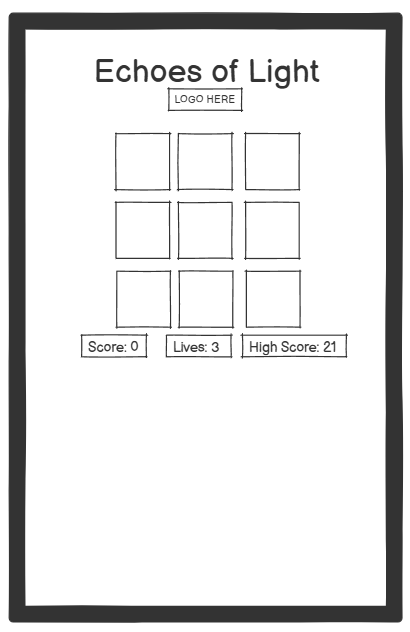
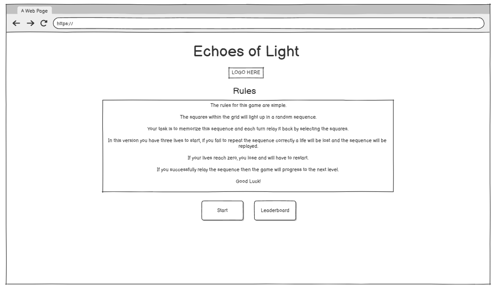
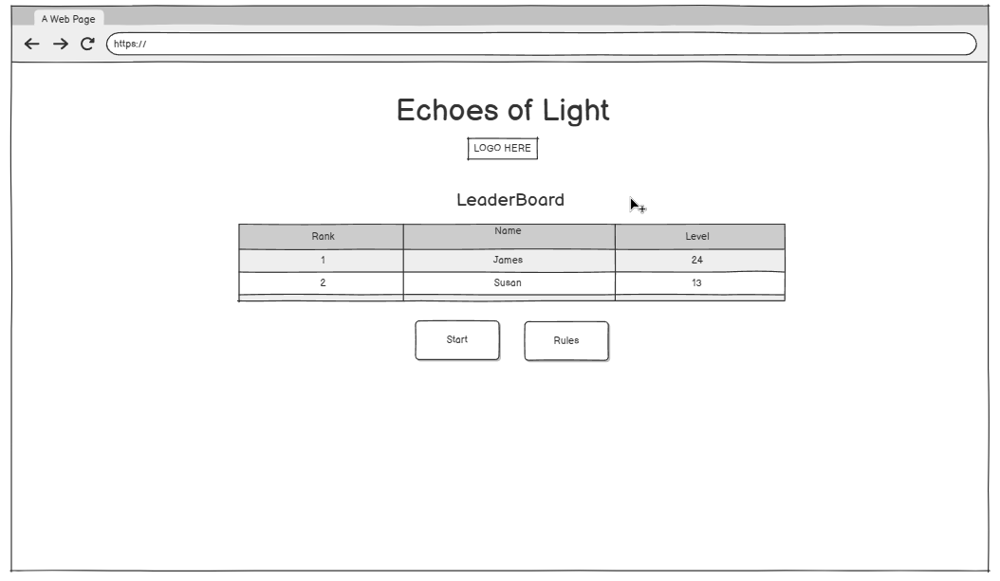
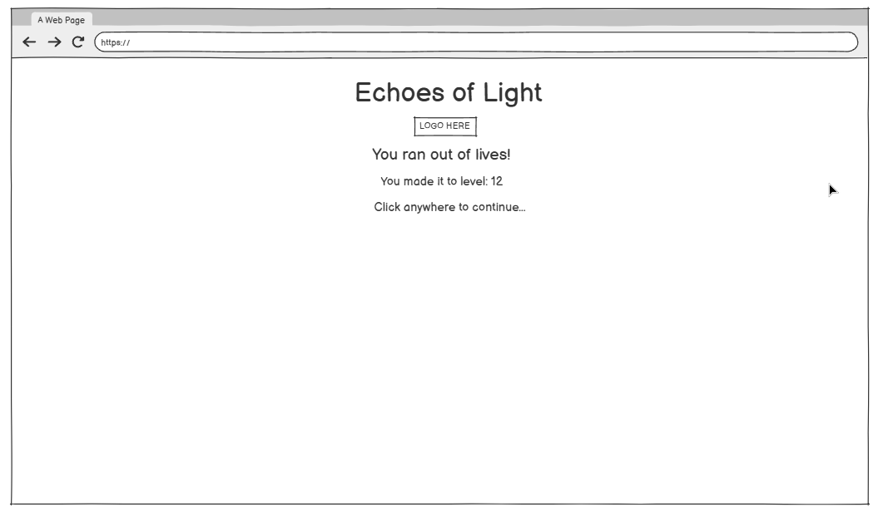
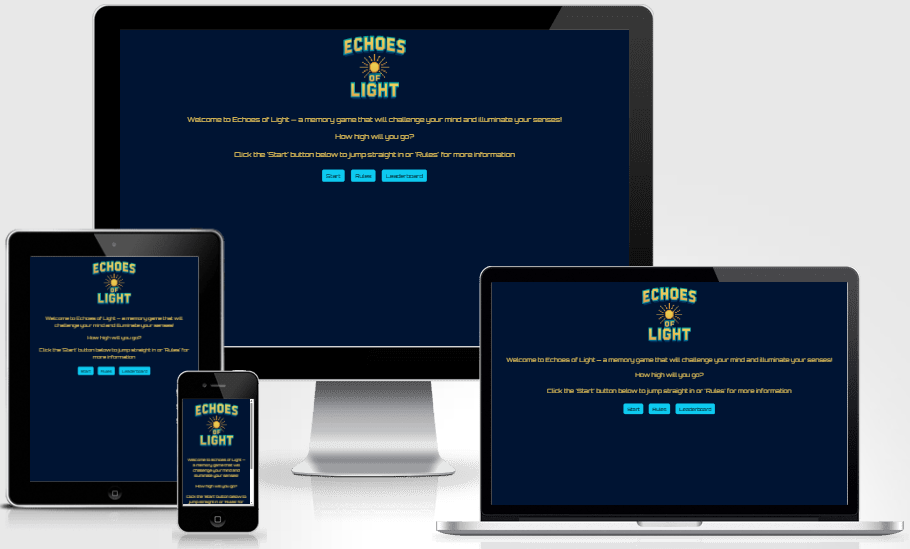
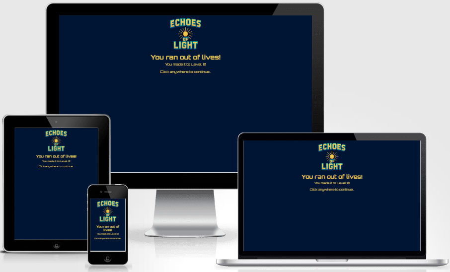

# Echoes of Light

---

![[Echoes of Light memory game displayed on different devices]](assets/documentation/am_i_responsive.png)

Visit the deployed site here: [Echoes of Light](https://ryan-ford25.github.io/Milestone_Project2/)

## Introduction

**Echoes of Light** is an interactive memory game designed to entertain, test and enhance the users memorising skills.

**The aim and purpose of the site** is to provide an engaging and competitive experience for people who would like to either test or improve their memory.

**The goal of the site** is to create an enjoyable experience where users can keep testing and improving their skills by using incorporated features such as the leaderboard and 'highest score' counter to push themselves further which creates a thrill of acomplishment bringing the user back for more.

Memory games help to improve another cognitive function such as concentration.

This game features a memory challenge inspired by the classic 'Simon' game, where players must recall and repeat an increasingly complex sequence. Players aim to achieve high scores to get top spot on the leaderboard. The competetive aspect encourages replayability, pushing players to sharpen their memory and beat personal bests.

**The target audience is all ages** who enjoy competition, testing their memory or both! It is designed for the casual player who would want to quickly see how good their memory is and the more competetive player who would want to work to improve their memory overtime.

---

## CONTENTS

- [User Experience](#ux)

  - [User Stories](#user-stories)

- [Design](#Design)
  - [Colour Scheme](#colour-scheme)
  - [Typography](#typography)
  - [Imagery](#imagery)
  - [Site Functionality Flow Diagram](#siteflow)
  - [Game Logic Overview](#gameplay)
  - [Wireframes](#wireframes)
    - [Mobile Wireframes](#mobile-frames)
    - [Tablet Wireframes](#tablet-frames)
    - [Desktop Wireframes](#desktop-frames)
      - [Features](#features)
      - [The Home Page](#home-page-features)
      - [The Rules Page](#rules-page-features)
      - [The Leaderboard Page](#leaderboard-page-features)
      - [The Difficulty Page](#difficulty-page-features)
      - [The Quiz Page](#quiz-page-features)
      - [The Results Page](#results-page-features)
      - [The 404 Page](#404-page-features)
      - [The 500 Page](#500-page-features)
      - [Future Implementations](#future-implementation)

* [Technologies Used](#technologies)

  - [Languages Used](#languages)
  - [Frameworks, Libraries & Programs Used](#frameworks)

* [Deployment & Local Development](#deployment-development)

  - [Deployment](#development)
  - [Local Development](#local-development)
    - [How to Fork](#fork)
    - [How to clone](#clone)

* [Testing](#testing-readme)

  - [Solved Issues & Bugs](#solved-issues)
  - [Known Issues & Bugs](#known-issues)

* [Credits & Inspiration](#credits&inspiration)
  - [Content](#content)
  - [Media](#media)
  - [Acknowledgement](#acknowledgement)

---

## User Experience (UX)

The game has been built with solely the user in mind, it offers an engaging and immersive experienced designed for all ages. Below are the key user-centric principles that make it fun and rewarding for all users:

1. **Engaging & Fun Experience** – The game is designed to be entertaining, immersive, and enjoyable for everyone
2. **Easy-to-Use Interface** – A clean, intuitive UI ensures seamless navigation and accessibility for players of all ages
3. **Responsive & Fast-Paced Gameplay** – Playeres memorise and relay a given sequence that gets longer each round
4. **Competitive & Replayable** – A leaderboard system encourages users to return, improve their scores, and challenge friends
5. **Interactive Feedback** – Instant updates to the score and lives left for correct or incorrect inputs provides a learning experience and player satisfaction
6. **Mobile-Friendly Design** – The game has been optimised for all screen sizes from desktops to mobiles allowing better accessibility from anywhere at any time
7. **Encourages Memory Recall** – Boosts memory rentention and cognitive functions

 

### User Stories

#### First-time visitor goals

- As a new site user, I want to have a clear and accessible way to navigate through different sections such as the rules, leaderboard and the game itself without difficulty.
- As a new site user, I want to understand the game rules quickly, so that I can start playing without confusion.
- As a new site user, I want to start my first game quickly, so that I can jump straight into the fun.
- As a new site user, I want to see my score and progress, so that I feel motivated to improve and replay.

#### Returning visitor goals

- As a returning site user, I want the game to function correctly across different devices, so that I can enjoy playing whether I’m on desktop, tablet, or mobile.

#### Frequent user goals

- As a frequent site user, I want to see a leaderboard of top scores, so that I can compare my performance with others and stay motivated to improve.

---

## Design

### Colour Scheme

The primary colours for the site are:
- `#001433` (Dark Blue) – This deep, dark shade is used as the **main background color**. Being a cool and sophisticated color it grounds the design and creates a sense of seriousness and depth immersing the user in the game.

- `#0DCAF0` (Vivid cyan): The **secondary background color** is bright and energetic used for the UI elements in order to engage and attract the users attention.

- `#E8B857` (Soft orange): Used for the text elements, as a **complimentary** color to blue it contrasts the background very well.

- `#008CA3` (Dark cyan): Used only in the logo to create a shadow effect.

This color scheme enhances clarity, feedback, and user experience while maintaining a clean and simplistic aesthetic.

- Toggle the arrow to view the colour swatches

 

### Typography

Google Fonts was used to import the selected fonts for the site, ensuring high-quality and easily accessible typography.

- The font [Orbitron](https://fonts.google.com/specimen/Orbitron?query=orbitronp&preview.text=Welcome%20to%20Echoes%20of%20Light) was chosen because it offers a clean, digital, and highly readable design that enhances user experience while maintaining a 'game' like aesthetic with a retro arcade feel.

 

### Site Functionality Flow Diagram

The diagram below shows the overall functionality of the webpage, including user interactions and level progression. It provides a structured view of how different components, such as variable updates and navigation integrate to deliver a seamless experience for the user.

 

## Game Logic Overview

The memory game follows a simple and structured flow to ensure a fair experience for all players. It begins with the user selecting either the 'Start', 'Rules' or 'Leaderboard' button, each displayed on the homepage, which will then show the corresponding screen. 

Once the 'Start' button has been selected the game will switch to the game screen and start by 'lighting' up the first square in the sequence.

The user must copy the sequence by clicking on the same squares that were shown. Each time the user correctly copies the given sequence the 'Level' variable will be updated by 1 and the sequence will be shown again with an additional square being added each time. If the sequence has not been copied correctly a life will be lost and the game will repeat the sequence, when all lives equal to 0 the end screen is displayed which will tell the user that they had ran out of lives and display the level that they reached. Players can choose to either commit their score to the leaderboard or exit to the homepage.

Below is a flowchart illustrating the complete game logic:

 

### Wireframes

Using [Balsamiq](https://balsamiq.com/), wireframes were developed for mobile, tablet, and desktop views. These wireframes played a crucial role in outlining the site’s structure and layout, ensuring a smooth user experience across different devices. The design process prioritized responsive adjustments to create an intuitive interface that adapts seamlessly to various screen sizes.

 

#### Mobile Wireframes

 Click here to see the Mobile Wireframes 

|                Home page wireframe                |                Rules page wireframe                 |                   Leaderboard page wireframe                    |
| :-----------------------------------------------: | :-------------------------------------------------: | :-------------------------------------------------------------: |
|  |  |  |

|                   Game page wireframe                   |               End page wireframe              |              
| :-----------------------------------------------------------: | :-----------------------------------------------: | 
|  |  | 

#### Tablet Wireframes

 Click here to see the Tablet Wireframes 

|                Home page wireframe                |                Rules page wireframe                 |                   Leaderboard page wireframe                    |
| :-----------------------------------------------: | :-------------------------------------------------: | :-------------------------------------------------------------: |
|  |  |  |

|                   Game page wireframe                   |               End page wireframe              |              
| :-----------------------------------------------------------: | :-----------------------------------------------: | 
|  |  | 

 

#### Desktop Wireframes

 Click here to see the Desktop Wireframes 

- Home page wireframe

- Rules page wireframe

- Leaderboard page wireframe

- Game page wireframe

- End page wireframe

 

The website consists of a home page featuring a series of different screen panels that are dynamically shown or hidden, controlled by buttons and page interaction.

All Pages on the website are responsive and have:

- A favicon in the browser tab.

 Click here to view the favicon 

#### The Home Page

 Click here to view the home page 

---

The home page for the Echoes of Light memory game was designed to be engaging and interactive in order to bring attention from new and returning users. Below are the key features and what they offer to the user:

- What it does:
  - Welcomes the user with a call-to-action: “Click the start button to jump straight in”.
  - Asks a rhetorical question: "How high will you go?".
  - Warm and friendly welcome : "Welcome to Echoes of Light — a memory game that will challenge your mind and illuminate your senses!".
- User Benefits:
  - Makes the game sound easy and immediate.
  - Tempts the user to test themselves.
  - Makes the user feel invited as well as give a bried description of whats to come.
- Interactive Elements:
  - Rules Button: Allows the user to view the rules of the game.
  - Leaderboard Button: Displays the top 10 scores.
  - Start Button: Starts the game immediately.

The homepage effectively sets the stage for whats to come. It provides an engaging, competitive, and replayable game that caters to all ages.

#### The Rules Page

 Click here to view the rules page 

---

- What it does:
  - Displays the games rules.
  - Explains mechanics such as how the lives and scoring works.
  - Provides the user with the option of either starting the game or viewing the leaderboard.
  - Ensures users understand the game mechanics before playing.
- Interactive Elements:
  - Start button: Begins the memory game straight away.
  - Leaderboard button: Displays the Leaderboard.

#### The Leaderboard Page

 Click here to view the leaderboard page 

---

- What it does:
  - Displays the Top 10 Highest Scores.
  - Dynamically updates as new scores are submitted.
  - Provides two options; start or rules.
- User Benefits:
  - Encourages competition and replayability.
  - Gives users a goal to aim for.
  - Creates an engaging social aspect by comparing scores.
- Interactive Elements:
  - Start button: Starts the game.
  - Rules button: Switches to rules screen.

#### The End page

 Click here to view the end page 

---

- What it does:
  - Tells the user they've run out of lives.
  - Displays the score they reached.
  - Prompts the user for their name for the leaderboard
- User Benefits:
  - Clearly signals the end of the game.
  - Gives progress feeback and performance recognition, driving the user to replay in order to beat their score.
  - Encourages rivalry and re-engagement, bringing them back to defend or improve their rank.
- Interactive Elements:
  - On screen Click: User can click anywhere making it quick and easy.

#### The Game page

 Click here to view the game page 

---

- What it does:
  - Displays the Sequence to the user.
  - Displays Current score.
  - Displays Lives.
  - Displays Highest score achieved.
  - All values are updated dynamically.
- User Benefits:
  - Fast-paced, interactive gameplay keeps users engaged.
  - Immediate feedback enhances the experience.

#### Future Implementations

To ensure the website remains engaging and functional for users, in future implementations I would like to:

1. **Night & Day Mode (Manual & System-Integrated)** – Introduce a toggle feature that allows users to manually switch between light and dark mode, while also offering an auto mode that adapts based on the user’s system settings. This ensures a comfortable viewing experience in any environment, reduces eye strain, and enhances accessibility for users who prefer high-contrast or low-light displays.
2. **Lifelines / Power-Ups** – Add options like “50/50” (removes two incorrect answers), “Extra Time” (adds 5 seconds), or “Skip Question” for a more strategic experience.
3. **Additional Question Categories** – Allow users to choose different music genres (e.g., Pop, Rock, Hip-Hop, 80s Hits) instead of a single general quiz.
4. **Personalized Music Recommendations** – Based on quiz performance, suggest songs or playlists (e.g., “You scored high on Rock – check out this playlist!”).
5. **Badges & Achievements** – Reward users with unlockable badges (e.g., “Pop Quiz Champion,” “Rock Guru”) for reaching milestones.
6. **Shareable Results & Social Media Integration** – Let users share their scores on Twitter, Instagram, or Facebook.
7. **Live Leaderboard** – Introduce a live leaderboard (rather than a locally stored version) to keep competition fresh and exciting. Allowing users to compete against each other.

---

## Technologies Used

### Languages Used

HTML, CSS, JavaScript

### Frameworks, Libraries & Programs Used

- [Balsamiq](https://balsamiq.com/) - Used to create wireframes.

- [Adobe Illustrator](https://www.adobe.com/uk/products/illustrator.html) - Used to design the logo and create visuals.

- [Adobe Photoshop](https://www.adobe.com/uk/products/photoshop.html) - Used to crop, resize, edit and save images to webp format.

- [Git](https://git-scm.com/) - For version control.

- [Github](https://github.com/) - To save and store the files for the website.

- [Visual Studio Code](https://code.visualstudio.com/) - Code editor used to create the site.

- [Mobile First Plugin](https://www.webmobilefirst.com/en/) - Chrome plug-in used to test responsiveness of the site on different devices.

- [Responsinator](http://www.responsinator.com/) - To show the website UI on a range of devices.

- [Am I Responsive?](http://ami.responsivedesign.is/) - Another site to show the website UI on a range of devices.

- [Google Fonts](https://fonts.google.com/) - To import the fonts used on the website.

- [Font Awesome](https://fontawesome.com/) - Icon library toolkit for social media icons.

- [Google Developer Tools](https://developers.google.com/web/tools) - To troubleshoot and test features, solve issues with responsiveness and styling.

- [Aria DevTools](https://github.com/ziolko/aria-devtools) - Used to view the website the way screen readers present it to visually impaired users.

- [Webpage Spell-Check](https://chrome.google.com/webstore/detail/webpage-spell-check/mgdhaoimpabdhmacaclbbjddhngchjik/related) - a google chrome extension that allows you to spell check your webpage. Used to check the site and the readme for spelling errors.

---

## Deployment & Local Development

### Deployment

The site is deployed using GitHub Pages - [Dj Silver Soul's Pop Quiz](https://sd-powell.github.io/portfolio_project_2/).

To Deploy the site using GitHub Pages:

1. Login (or sign up) to Github.
2. Go to the repository for this project, [sd-powell/portfolio_project_2](https://github.com/sd-powell/portfolio_project_2).
3. Click the settings button.
4. Select pages in the left hand navigation menu.
5. From the source dropdown select main branch and press save.
6. The site has now been deployed, please note that this process may take a few minutes before the site goes live.

### Local Development

#### How to Fork

To fork the repository:

1. Log in (or sign up) to Github.
2. Go to the repository for this project, [sd-powell/portfolio_project_2](https://github.com/sd-powell/portfolio_project_2).
3. Click the Fork button in the top right corner.

#### How to Clone

To clone the repository:

1. Log in (or sign up) to GitHub.
2. Go to the repository for this project, [sd-powell/portfolio_project_2](https://github.com/sd-powell/portfolio_project_2).
3. Click on the code button, select whether you would like to clone with HTTPS, SSH or GitHub CLI and copy the link shown.
4. Open the terminal in your code editor and change the current working directory to the location you want to use for the cloned directory.
5. Type 'git clone' into the terminal and then paste the link you copied in step 3. Press enter.

---

## Testing

> [!NOTE]
> Please refer to [TESTING.md](TESTING.md) file for all testing carried out.

### Solved Issues & Bugs

| No | Bug Description | Solution | Screenshot |
| :- | :------------- | :-------- | :--------- |
| 1  | When testing the HTML code with the W3C validator, it flagged an issue with trailing slashes (e.g., ` `). This was caused by the formatter in VS Code. | I disabled "Format on Save" in VS Code to resolve the issue and re-tested my HTML code. |  |
| 2 | Initially, I was unable to correctly highlight selected answers using the API data for each question. I wanted to assign correct and incorrect values to the buttons so they could be visually indicated to the user with a tick or a cross. | I implemented a function to parse the API data and dynamically assign a custom `data-correct="true"` attribute to the correct answer button. This ensured that both correct and incorrect answers could be properly styled after a button was selected. |  |
| 3  | When a user leaves the name field blank or enters only spaces before submitting, Chrome displays its default alert: `"Please enter your name before submitting!"`. My mentor suggested replacing this with a JavaScript alert using [SweetAlert2](https://sweetalert2.github.io/). | I installed the SweetAlert2 CDN link and implemented a custom alert modal. |  |
| 4  | When testing the site on small screens (320px wide), part of the main panel was cropped by the viewport. | I added a media query `@media screen and (max-width: 320px) and (max-height: 568px)`, which removed the background image and repositioned the panel at the top of the screen. |  |
| 5  | In my first project, I realised that I didn't implement ARIA labels for my background images. | I researched how to add ARIA labels to the `<header>` element, ensuring they appeared correctly in the ARIA testing tool I used. |  |
| 6 | Whilst testing the site using [Aria DevTools](https://github.com/ziolko/aria-devtools), I noticed that the home panel (`info_panel`) remained visible to screen readers, even though it was hidden in the UI when other panels were displayed. Additionally, when manually resizing the site to test responsiveness, the ease effect caused brief glimpses of the home panel beneath other elements. | I researched the best way to fully hide content from screen readers and found that `visibility: hidden;` was the most effective approach. I added this rule to the CSS and created a JavaScript function to add and remove the `.hidden` class, ensuring that the `info_panel` is properly hidden both visually and from assistive technologies when other panels are displayed. |  |
| 7 | On screens smaller than 368px, the tick and cross icons on the answer buttons were positioned too close to the border. | I added a rule to the 368px media query to adjust their positioning to 40px from the right. |  |

---

### Known Issues & Bugs

| No | Bug Description | Screenshot |
| :- | :------------- | :--------- |
| 1 |	I have noticed that when the keyboard appears on mobile devices while a user is submitting their name in the form field, the panel is nudged up the screen, slightly obscuring the header background image. A tutor advised me that this shouldn’t be a concern. |  |

---

## Credits & Inspiration

- This [YouTube tutorial](https://www.youtube.com/watch?v=xZXW5SnCiWI&t=2918s) was incredibly helpful in shaping the key features of my quiz. It provided valuable insights into concepts like hiding and displaying panels, implementing a timer, and showing correct and incorrect answers after a response. These elements not only enhanced my understanding but also gave me the confidence to develop my own features.

- I wanted a simple way to save high scores without using a database, and local storage seemed like a feasible option. After extensive research and referencing the following tutorials, I successfully implemented a function for my site.
  - This [YouTube tutorial](https://youtu.be/DFhmNLKwwGw?si=_Ccj6qyp0WI2XPuf) taught me how to save the name and score as an object, store it in an array within local storage, and sort the array in descending order based on the score.

- Additionally, I watched [This YouTube tutorial](https://www.youtube.com/watch?v=UY6AeR_M_dU) to learn how to use the [Open Trivia API](https://opentdb.com/) in my project.

- I drew inspiration from [MyFitnessPal](https://www.myfitnesspal.com/) for the site’s color scheme and interface design.

- This post on [Stack Overflow](https://stackoverflow.com/questions/24127507/is-it-possible-to-center-tables-in-a-markdown-file) helped me to understand markdown tables and positioning.

### Content

Every question on my site was sourced via the API from [The Open Trivia Database](https://opentdb.com/).

All other content for the site is written by myself.

### Media

- [Adobe Stock](https://stock.adobe.com/) - Used to source royalty free imagery for the site.

### Acknowledgments

I would like to acknowledge the following people:

 

[🔼 Back to top](#contents)