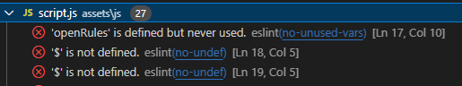
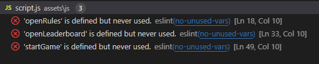
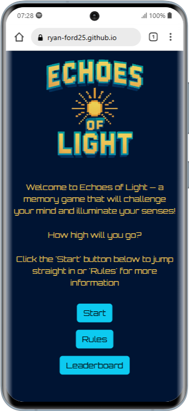

# Testing

Visit the deployed site here: [Echoes of Light](https://ryan-ford25.github.io/Milestone_Project2/)

> [!NOTE]  
> Return back to the [README.md](README.md) file.

This document outlines the testing processes and results for the **Echoes of Light** memory game. It ensures that all features function as expected, meet accessibility standards, and provide an optimal user experience.

---

## CONTENTS

- [AUTOMATED TESTING](#automated-testing)
  - [W3C Validator](#w3c-validation)
  - [W3C CSS Validator](#css-validation)
  - [JavaScript Validator](#js-validation)
  - [Lighthouse](#lighthouse)
- [MANUAL TESTING](#manual-testing)
  - [Full Testing](#full-testing)
  - [Browser Compatibility](#browser)
  - [Responsiveness](#responsiveness)
  - [Accessibility](#accessibility)
  - [Testing User Stories](#testing-user)
  - [Features Testing](#features-test)
  - [Existing Features](#existing-features)
  - [Manual Features Testing](#manual-features-test)

 

Testing was an **integral part of the development process**, ensuring the website remained both **functional and user-friendly** at every stage. By conducting **continuous testing**, potential issues were identified early, allowing for swift resolution and a more efficient workflow.

**Chrome Developer Tools** played a crucial role throughout development, providing real-time insights into performance, responsiveness, and debugging. This proactive approach helped streamline development and ensure the final product adhered to high-quality standards.

Additionally, **ChatGPT** served as a key resource for refining ideas, optimizing content, and overcoming technical challenges. By offering structured guidance, best practices, and alternative solutions, it contributed to improving both the efficiency of development and the overall quality of the final product.

To guarantee **cross-device compatibility**, every page was rigorously tested across various **screen sizes and devices** using Chrome Developer Tools. This process ensured that Echoes of Light was fully responsive, providing a seamless user experience across **desktops, tablets, and mobile devices**.

---

## AUTOMATED TESTING

A series of **automated testing** tools were used on the site to check the code for web standard compliance and errors. These tools ensured repeatable, scalable, and performance-driven results throughout the site’s development.

### W3C Validator

[W3C](https://validator.w3.org/) was used to validate the HTML of the webpage.

| Directory | File tested | Screenshot | Notes |
| --------- | ----------- | ---------- | ----- |
| assets/documentation/html_validation.PNG | index.html |  | no errors occurred when checking |

---

### CSS Validator

[CSS W3C Validator](https://jigsaw.w3.org/css-validator/) was used to validate my CSS file.

| Directory                                | File tested  | Screenshot                                              | Notes                            |
| ---------------------------------------- | ------------ | ------------------------------------------------------- | -------------------------------- |
| assets/documentation/css_validation.PNG | style.css    |   | ⚠ There was 1 warning that appeared but this was not an issue as it was notifying me the validator wouldn't check the imported font style sheet|

### JavaScript Validator

The [JSHint](https://jshint.com/) website was used to validate the JavaScript code. I also installed [ESLint](https://eslint.org/) in [VS Code](https://code.visualstudio.com/), which automatically checked my JavaScript code in the console and reported any errors.  

I attempted to test with [Jest](https://jestjs.io/) but I encountered complications when importing functions into my test scripts. After assessing the time required to resolve these issues, I decided it would be more efficient to use the testing methods mentioned above.

| Validator | Issue found | Solution | Screenshot |
| :- | :------------- | :-------- | :--------- |
| ESLint  | When running the 'ESlint' extension in visual studio code it displayed a problem with the use of '$' as it was undefined | After searching online I found that it is because I didn't say that jQuery was being used when I ran enlist for the first time. To fix this I added /* global $ */ to the top of the javaScript file. |  |
| ESLint | Another problem found by the ESLint extension were variables that were defined but never used. However the variables were being used by the index.html file in order for the buttons to work. |  I attached the functions to the global scope using 'window.startGame = startGame; which fixed the issue. |  | 
| JSHint | The Jshint tool displayed the warning "Functions declared within loops referencing an outer scoped variable may lead to confusing semantics. (game, lightUp, playerTurn) | After doing some research I found that this wasn't a pressing issue as the code has been functioning as it should through all other test, but it could be solved by extracting the function out of the loop. |  |
| JSHint | Had multiple warnings listed as "'let' is available in ES6 (use 'esversion: 6') or Mozilla JS extensions (use moz)." This is JSHint warning you that the 'let' functions are only supported in ESversion: 6 but was running an older version at the time of using the tool | To fix this error I ammended the configuration to use new JavaSript features using the configuration setting. |  |

---

### Lighthouse

I've tested my deployed project using the Lighthouse Audit tool to test the performance, accessibility, best practices and SEO of the website.

| Mobile | Desktop | Notes |
| :--: | :--: | :--: |
|  |  | Both tests passed and came back with excellent results |
---

## MANUAL TESTING

### Full Testing

This section outlines the **manual testing** process conducted to ensure the website functions correctly across different devices, screen sizes, and user interactions. Each test was performed methodically to identify potential issues with responsiveness, usability, and accessibility, with results documented for further improvements. Additional testing was taken by friends and family on a variety of devices and screen sizes.

---

### Browser Compatibility

- [Safari](https://www.apple.com/uk/safari/)
- [Chrome](https://www.google.com/chrome)
- [Firefox](https://www.mozilla.org/firefox)
- [Bing](https://www.bing.com/)
- [Edge](https://www.microsoft.com/en-gb/edge?form=MA13FJ)

I tested my deployed project on multiple browsers to check for compatibility issues.

---

### Responsiveness

In addition to testing my deployed site on different devices, I thoroughly tested its responsiveness using Chrome Developer Tools.  
I researched the **narrowest width of modern devices** on [Stack Exchange](https://ux.stackexchange.com/questions/74798/are-there-devices-narrower-than-320px-and-data-on-their-usage-for-web-browsing) and based my testing on **320px** as a standard minimum width.  
Additionally, I used the [Mobile First Plugin](https://www.webmobilefirst.com/en/), a Chrome extension designed to test site responsiveness across different devices.

#### Mobile Devices

| Device tested | Screen Width (px) | Screen Height (px) | Result |
| :-------------: | :---------------: | :----------------: | :------: | 
| iPhone 5
 | 320px | 568px | Passed |
| iPhone 13 
| 390px | 844px | Passed |
| Samsung S20 
 | 360px | 800px | Passed | 
| Google Pixel 8
 | 412px | 916px | Passed |

#### Tablets

| Device tested | Screen Width (px) | Screen Height (px) | Result |
| :------------: | :--------------: | :----------------: | :------: |
| iPad Mini 
 | 768px | 1024px | Passed |
| Galaxy Tab S7
 | 800px | 1280px |  Passed |
| iPad Pro 11 
 | 834px | 1194px | Passed | 

#### Laptops & Desktops

| Device tested | Screen Width (px) | Screen Height (px) | Result | 
| :------------: | :---------------: | :-----------------: | :---: |
| MacBook Air 13” 
| 1280px | 800px | Passed | Fully responsive |
| Dell Latitude 
| 1440px | 809px | Passed | Fully responsive |
| iMac 24"
 | 2048px | 1142px | Passed | Fully responsive |

---

### Accessibility

#### Colour contrast compliance

To ensure that the colours used on the webpage weren't going to make it harder for visually impaired people to see I used [WebAim](https://webaim.org/resources/contrastchecker/) to see how good the colours chosen paired together for large and small bodies of text, the results are shown below: 

| Foreground colour | Background colour | Screenshot | Testing results |
| :-----------------: | :-----------------: | :---------------: | :---------------: |
| `#E7C358`         | `#001433`         | | Passed on all text sizes and graphical objects. |
| `#0DCAF0`         | `#001433`         | | Passed on all text sizes and graphical objects. |
| `#008CA3`         | `#001433`         | | Failed 'WCAG AAA' small text test and passed on all others but with a much lower score, however this is not an issue as this color was used to create a shadow effect for the logo. |
---

### Testing User Stories

#### First Time Visitors

| Goals | How were they achieved? |
| ------ | -------------------------- |
| **As a new site user, I want to have a clear and accessible way to navigate through different sections such as the rules, leaderboard and the game itself without difficulty** | The homepage provides clear buttons for Starting the game, viewing the rules and leaderboard. All buttons include ARIA labels for accessibility. |
| **As a new site user, I want to understand the game rules quickly, so that I can start playing without confusion.** | The Rules Page presents a quick and simple explanation of the rules in a list format. It outlines how to play, how the lives system works and how the scoring system works. The 'Start' button at the bottom allows for a quick transition after the user is done reading them. |
| **As a new site user, I want to start my first game easily, so that I can jump straight into the fun.** | The homepage contains a 'Start' button which allows the user to jump straight in making the process from loading the page to playing the game quick and seamless |
| **As a new site user, I want to see my score and progress, so that I feel motivated to improve and replay.** | On the Game screen at the bottom is a display for the score which updates automatically as they progress and at the end of the game the level they reached is displayed **encouraging a replay** and their high score is updated for the next game. |

#### Returning Visitors

| Goals | How were they achieved? |
| ------ | -------------------------- |
| **As a returning site user, I want the game experience to be consistent and function correctly across different devices, so that I can enjoy playing whether I’m on desktop, tablet, or mobile.** | The site uses a responsive design that adapts to different screen sizes. All interactive elements remain functional and accessible on various devices and browsers. |

#### Frequent Site Visitors

| Goals | How were they achieved? |
| ------ | -------------------------- |
| **As a frequent site user, I want to see a leaderboard of top game scores, so that I can compare my performance with others and stay motivated to improve.** | The Leaderboard page dynamically updates with the top 10 scores. Users can submit their name and see their ranking after completing a run of the game. |
---

## Features Testing

### Existing Features

### Home Page page

#### Overview
The **Home Page** serves as the entry point, introducing users to the game and providing navigation options to key sections. It ensures a smooth experience for the user with an engaging simple aesthetic.

#### Features Tested:
- **Introduction & Engagement:**  
  - The page presents a clear and engaging welcome message that highlights what type of game it is and immediately tempts the user to a challenge.  
  - The description uses clear bold to make the text standout. 
  - The message is formatted properly, ensuring readability across different devices.  

- **Navigation & Call to Action:**  
  - The "Rules" button (`#rules`) correctly navigates users to the rules page.  
  - The "Leaderboard" button (`#leaderboard`) allows users to view the top scores.  
  - The "Start" button (`#start`) initiates and smoothly transitions users into the game.  
  - ARIA labels are applied to all buttons for improved accessibility.  

- **Branding & Design:**  
  - The site’s branding is consistently maintained, with a simple digital/arcade design.  
  - The layout is structured using an unordered list with the (`<ul>`) tag for easy readability.  
  - The buttons are clearly labeled and appropriately styled, making navigation intuitive.
  -  - Semantic HTML elements (`<ul>`, `<li>`, `<button>`) improve screen reader support.  

- **Responsiveness & Accessibility:**  
  - The home page adapts well to various screen sizes (desktop, tablet, mobile).    
  -   

- **Performance & Functionality:**  
  - The home page loads quickly, with no missing or broken elements.  
  - The buttons work correctly, allowing users to navigate between sections without errors.  

Click here to see the Home Page page

 

### Rules page

#### Overview
The **Rules Page** provides users with clear and concise guidelines on how the game. It ensures players understand the gameplay mechanics, scoring and lives systems.

#### Features Tested:
- **Rules Display & Readability:**  
  - The page correctly presents the key game rules in a list format using the unordered list tag, (`<ul>`).  
  - The rules are structured for easy reading and clearly outline:  
    - How the sequence is shown  
    - The users task (relaying the sequence)  
    - How the lives system works if an input is incorrect
    - Scoring system, how it works when an input is correct
  - The text is easily readable on all devices. 

- **Navigation & Call to Action:**  
  - The "Start" button (`#start2`) begins the game and transitions users smoothly.  
  - The "Exit" button (`#leaderboard2`) allows users to return to the home page.  
  - ARIA labels are applied to all buttons for improved accessibility.  

- **Branding & Design:**  
  - The rules page follows the consistent styling of the site, ensuring visual uniformity.  
  - The button layout is intuitive, with "Exit" and "Start" options clearly defined.  
  - The list structure ensures that it is formatted correctly across all devices.  

- **Responsiveness & Accessibility:**  
  - The buttons change from a row format to a collumn for mobile devices to adjust to screensize.  
  - The grid adjusts it's size for smaller devices such as mobiles.
  - Semantic HTML elements (`<h2>`, `<ul>`, `<li>`, `<button>`) improve screen reader support.  

- **Performance & Functionality:**  
  - The rules page loads quickly, with no broken elements or missing content.  
  - The "Start" button correctly transitions users into the game.
  - The "Leaderboard" button correctly transitions users to the leaderboard screen.  

Click here to see the Rules page

 

### game page

#### Overview
The **game page** provides an interactive interface for uses to see and relay the given sequence. It dynamically updates the sequence, manages user responses, and displays the current score and lives aswell as displays the correct high score value if the user has played already. The page ensures a smooth and engaging game experience.

#### Features Tested:
- **Sequence Display & Dynamic Updates:**  
  - The sequences are shown correctly with delays inbetween.
  - The sequence updates for the next 'level' without issues.
  - The timing of the displayed sequence is consistent everytime. 
  - (`#high_score`) will display the correct value if a game has already been played by the user.

- **Checking User Input**  
- The game identifies the users input correctly.
- Checks if it is correct and displays the selected squares.

- **Score * Lives Tracking*:**  
  - The (`#score`) will be updated if the user relays the same sequence.
  - The (`#lives`) will be updated if the user relays the incorrect sequence.  
  - Users will recieve immediate feedback with updated (`#score`) and (`#lives`) values.
  - The (#`high_score`) will be updated if the current score value is larger.

- **Branding & Design:**  
  - The game page maintains a consistent theme and visual design with the rest of the site.  
  - The layout is structured for easy readability and user engagement.    

- **Responsiveness & Accessibility:**  
  - The game adapts correctly between mobile and larger screens.(desktop, tablet, mobile).  

- **Performance & Functionality:**  
  - The game displays the sequences with the correct delay without any broken elements.
  - The game replays the same sequence after an incorrect input correctly without broken elements.
  - User input is disabled (While a sequence is being displayed) and enables (when the sequence has finished playing) at the correct time.

Click here to see the game page

 

### End Page

#### Overview
The **End page** provides users with a clear message to explain that the game has ended. It displays the message 'You ran out of Lives' aswell as the level they achieved. It gives a prompt for the users name and saves it locally for the leaderboard and then continues to the home page.

#### Features Tested:
- **Score Display & Feedback:**  
  - The page correctly displays the user’s final score with `document.getElementById("end_score").innerText = You made it to Level: ${game.score}`;.

- **Leaderboard Submission Functionality:**  
  - The name input field (`#name`) allows users to enter their name or nickname.    
  - The "Submit" button (`#submit`) correctly registers the name and score in the leaderboard.  

- **Navigation & Call to Action:**  
  -The screen instantly loads the home page again once the submit button is pressed.

- **Branding & Design:**  
  - The page maintains a **consistent visual style** with the rest of the site.  
  - The **input field and buttons** are clearly distinguishable and properly styled.  
  - The layout is structured to ensure easy readability and interaction.  

- **Responsiveness & Accessibility:**  
  - The End page adapts well to different **screen sizes** (desktop, tablet, mobile).  
  - The **form elements (`<input>`, `<button>`)** are accessible via keyboard navigation and screen readers.  
  - The use of **semantic HTML elements** (`<h2>`, `
`, `<form>`, `<input>`, `<button>`) enhances accessibility.  

- **Performance & Functionality:**  
  - The **score updates dynamically** upon game completion.  
  - The **submission form works correctly**, preventing invalid inputs and successfully adding scores to the leaderboard.  
  - The page loads **efficiently** without broken elements or layout shifts.  

Click here to see the End page

 

### Leaderboard page

#### Overview
The **Leaderboard page** provides users with a ranked list of the top 10 scores, dynamically updating based on game performance. It enhances user engagement by displaying competitive scores and offering options to restart or exit the game.

#### Features Tested:
- **Leaderboard Display & Dynamic Updates:**  
  - The **top 10 scores** are displayed in a structured table format.  
  - The `<tbody>` section dynamically updates with user scores after game completion.  
  - **Ranks, names, and scores** are correctly displayed in descending order.  

- **Navigation & Call to Action:**  
  - The **"Exit" button** allows users to return to the home page.  
  - The **"Restart game" button** lets users immediately begin a new game session.  
  - **ARIA labels** are applied to buttons for improved accessibility.  

- **Branding & Design:**  
  - The page maintains the **consistent styling** of the site.  
  - Uses **clear, readable fonts** and a structured table format for clarity.  
  - Buttons follow the **expected UI conventions** (`outline_btn` for exit, `reverse_btn` for restart).  

- **Responsiveness & Accessibility:**  
  - The leaderboard layout adapts to different **screen sizes** (desktop, tablet, mobile).  
  - Uses **semantic HTML elements** (`<table>`, `<th>`, `<tbody>`) to ensure proper screen reader support.  
  - Button labels and interactive elements comply with **ARIA accessibility guidelines**.  

- **Performance & Functionality:**  
  - The leaderboard updates **instantly** after the game is completed.  
  - The **Exit and Restart buttons** work as expected, redirecting users appropriately.  
  - The page loads **without delays or broken styling**, ensuring a smooth user experience.  

Click here to see the Leaderboard page

 

## Manual Features Testing

### Home Page

| Component | Expected Behavior | Testing Steps | Actual Result | Fix (if needed) | Screenshot |
| --- | --- | --- | --- | --- | --- |
| **Rules** button | The **rules** page should open, displaying instructions on how to play the game | Clicked on the **rules** button | The **rules** page opened and displayed the instructions correctly | ✅ No fix needed |  |
| **Leaderboard** button | The **leaderboard** page should open and display the top 10 scores, ranked by position, player name, and score | Clicked on the **leaderboard** button | The **leaderboard** page opened and displayed the top 10 scores correctly | ✅ No fix needed |  |
| **Start** button | The **difficulty** page should open, displaying three buttons that allow the user to choose between *Easy*, *Medium*, or *Hard* game questions | Clicked on the **Start** button | The **difficulty** page opened and displayed the three difficulty buttons | ✅ No fix needed |  |
| **Rules** and **Leaderboard** buttons - hover effect | When hovered over, the **Rules** and **Leaderboard** buttons should change to a white background with light blue text | Hovered over the **Rules** and **Leaderboard** buttons | The **Rules** and **Leaderboard** buttons changed to a white background with light blue text when hovered over | ✅ No fix needed |     |
| **Start** button - hover effect | When hovered over, the **Start** button should change from dark blue text to white text | Hovered over the **Start** button | The **Start** button changed from dark blue text to white text when hovered over | ✅ No fix needed |   |

---

### game Rules Page

| Component | Expected Behavior | Testing Steps | Actual Result | Fix (if needed) | Screenshot |
| --- | --- | --- | --- | --- | --- |
| **Exit** button | The **rules** page should close, revealing the home page page | Clicked on the **Exit** button | The **rules** page closed, and the home page page was revealed | ✅ No fix needed |  |
| **Start game** button | The **difficulty** page should open, displaying three buttons that allow the user to choose between *Easy*, *Medium*, or *Hard* game questions | Clicked on the **Start game** button | The **difficulty** page opened and displayed the three difficulty buttons | ✅ No fix needed |  |
| **Exit** button - hover effect | When hovered over, the **Exit** button should change to a white background with light blue text | Hovered over the **Exit** button | The **Exit** button changed to a white background with light blue text when hovered over | ✅ No fix needed |   |
| **Start game** button - hover effect | When hovered over, the **Start** button should change from dark blue text to white text | Hovered over the **Start** button | The **Start** button changed from dark blue text to white text when hovered over | ✅ No fix needed |   |

---

### Leaderboard Page

| Component | Expected Behavior | Testing Steps | Actual Result | Fix (if needed) | Screenshot |
| --- | --- | --- | --- | --- | --- |
| **Exit** button | The **leaderboard** page should close, revealing the **home page** page | Clicked on the **Exit** button | The **leaderboard** page closed, and the **home page** page was revealed | ✅ No fix needed |  |
| **Restart game** button | The **difficulty** page should open, displaying three buttons that allow the user to choose between *Easy*, *Medium*, or *Hard* game questions | Clicked on the **Restart game** button | The **difficulty** page opened and displayed the three difficulty buttons | ✅ No fix needed |  |
| **Scores** are displayed | If the user achieves and submits a score that ranks within the top ten of previously submitted scores, it should be displayed in the  **leaderboard** table | Played the game and aimed to beat the lowest score in the current **leaderboard** | The highest scores in the top ten were successfully submitted and displayed in the **leaderboard** table | ✅ No fix needed | 
| **Exit** button - hover effect | When hovered over, the **Exit** button should change to a white background with light blue text | Hovered over the **Exit** button | The **Exit** button changed to a white background with light blue text when hovered over | ✅ No fix needed |   |
| **Restart game** button - hover effect | When hovered over, the **Restart game** button should change from dark blue text to white text | Hovered over the **Restart game** button | The **Restart game** button changed from dark blue text to white text when hovered over | ✅ No fix needed |   |

---

### Difficulty Page

| Component | Expected Behavior | Testing Steps | Actual Result | Fix (if needed) | Screenshot |
| --- | --- | --- | --- | --- | --- |
| **Easy** button | The **difficulty** page should close, revealing the **game** page. The API should be called using the easy game URL | Clicked on the **Easy** button | The **difficulty** page closed, the **game** page opened. The API call was logged to the console | ✅ No fix needed |  |
| **Medium** button | The **difficulty** page should close, revealing the **game** page. The API should be called using the medium game URL | Clicked on the **Medium** button | The **difficulty** page closed, the **game** page opened. The API call was logged to the console | ✅ No fix needed |  |
| **Hard** button | The **difficulty** page should close, revealing the **game** page. The API should be called using the hard game URL | Clicked on the **Hard** button | The **difficulty** page closed, the **game** page opened. The API call was logged to the console | ✅ No fix needed |  |
| **Exit** button | The **difficulty** page should close, revealing the **home page** page | Clicked on the **Exit** button | The **difficulty** page closed, and the **home page** page was revealed | ✅ No fix needed |  |
| **Difficulty** buttons - hover effect | When hovered over, the **difficulty** buttons should change from a dark blue background to a light blue background | Hovered over each **difficulty** button | The **difficulty** buttons changed from a dark blue background to a light blue background when hovered over | ✅ No fix needed |  |
| **Exit** button - hover effect | When hovered over, the **Exit** button should change to a white background with light blue text | Hovered over the **Exit** button | The **Exit** button changed to a white background with light blue text when hovered over | ✅ No fix needed |   |

### ⛔️ Difficulty Page - Negative Testing Scenarios

| Component | Expected Behavior | Negative Test Performed | Actual Result | Fix (if needed) | Screenshot |
| --- | --- | --- | --- | --- | --- |
| Corrupt API Data | The game should gracefully handle missing or broken data | Modified API url to return incomplete data and selected each difficulty button to activate API call | game was redirected to 500 error page | ✅ No fix needed |  |
| Score Reset on Restart | Score should reset to `0` when restarting game | Clicked on each **Difficulty** button in turn to restart the game | Score was reset to `0` each time | ✅ No fix needed |  |

---

### game Page

| Component | Expected Behavior | Testing Steps | Actual Result | Fix (if needed) | Screenshot |
| --- | --- | --- | --- | --- | --- |
| **Question no.** indicator | After the game begins, the **question no.** indicator should increment by 1 each time the **Next button** is clicked after a question is answered or when the timer expires  | Clicked the **Next button** after the game began | The **Question No.** indicator incremented by **1** when the **Next button** was clicked | ✅ No fix needed |  |
| **Timer** function | After the game begins, the **Timer** should count down from **15 to 0**. When the Timer reaches **0**, “Time’s up!” should be displayed. Upon clicking the **Next button**, the **Timer** should reset to “Time: 15” and start counting down again | Selected a **difficulty** level to start the game. Clicked the **Next** button to reset the **Timer** | The game began, and the **Timer** counted down from **15 to 0**. “Time’s up!” was displayed. After clicking the **Next** button, the **Timer** reset to “Time: 15” and restarted the countdown | ✅ No fix needed |  |
| **Time line** function | After the game begins, the Time Line should decrease in width by 1/15 for each second the timer decrements | Selected a **difficulty** level to start the game. Clicked the **Next** button to reset the **Timer** | The game began, and the **Time Line** decreased in width by 1/15 each second as the timer decremented | ✅ No fix needed |  |
| **Timer pause** function | After a question is answered, the **Timer** and **Time Line** should pause immediately | Answered a question | The **Timer** and **Time Line** paused immediately | ✅ No fix needed |  |
| **game questions** and **answers** | A new set of **game questions** and **answers** should be displayed each time the game begins or the **Next** button is clicked | Selected a **difficulty** level to start the game. Clicked the **Next** button to access the next question | A new set of **game questions** and **answers** was displayed each time | ✅ No fix needed |  |
| **Correct** and **Incorrect** answer indicators | When an answer is submitted: if it is **correct**, the border of the selected answer button should turn **green**, and a **green tick icon** should appear to the right of the answer text inside the button. If the answer is **incorrect**, the border of the selected answer button should turn **red**, and a **red cross icon** should appear to the right of the answer text inside the button. If the **timer expires**, the correct answer should be highlighted with a **green border** and a **green tick icon** | Selected both **correct** and **incorrect** answers. Allowed the timer to expire | When a **correct** answer was selected, the border turned **green**, and a **green tick icon** appeared. When an **incorrect** answer was selected, the border turned **red**, and a **red cross icon** appeared. When the **timer** expired, the **correct** answer was displayed with a **green** border and a **green tick icon** | ✅ No fix needed |   |
| **Score** function | When a question is answered correctly, the **score** should increment by **10**, up to a maximum of **100** for 10 correct answers | Answered **10** questions correctly | The **score** incremented by **10** for each correct answer, reaching a maximum of **100** for **10** correct answers | ✅ No fix needed |  |
| **Next** button | When an answer is selected or when the timer expires, revealing the correct and/or incorrect answers, the **Next** button should appear. Upon clicking the **Next** button, the **next question** should be displayed, the timer should reset, the **question number** should increment, and the **Next** button should disappear | Selected an answer and allowed the timer to expire | When an answer was selected or the timer expired, the correct and/or incorrect answers were displayed, and the **Next** button appeared. Upon clicking the **Next** button, the next question was shown, the timer reset, the question number incremented, and the **Next** button disappeared | ✅ No fix needed |  |
| **Exit** button | The **game** page should close and the game should end, revealing the **home page** page | Clicked on the **Exit** button | The **difficulty** page closed and the game ended, and the **home page** page was revealed | ✅ No fix needed |  |
| **Answer** buttons - hover effect | When hovered over, the **Answer** buttons should change from a dark blue background to a light blue background | Hovered over each **Answer** button | The **Answer** buttons changed from a dark blue background to a light blue background when hovered over | ✅ No fix needed |  |
| **Exit** button - hover effect | When hovered over, the **Exit** button should change to a white background with light blue text | Hovered over the **Exit** button | The **Exit** button changed to a white background with light blue text when hovered over | ✅ No fix needed |   |
| **Next** button - hover effect | When hovered over, the **Next** button should change from a green background to a white background | Hovered over the **Next** button | The **Next** button changed from a green background to a white background | ✅ No fix needed |   |

### ⛔️ game Page - Negative Testing Scenarios

| Component | Expected Behavior | Negative Test Performed | Actual Result | Fix (if needed) | Screenshot |
| --- | --- | --- | --- | --- | --- |
| **Timer** Expiry | Should disable answer buttons when an answer is selected or when the time is up | Selected an answer and allowed timer to expire. Clicked on each answer button | Answer buttons were disabled | ✅ No fix needed |  |
| Answering Questions Rapidly | Answering questions rapidly and clicking **Next** too fast should not break the game | Answered questions and clicked **next** rapidly | Questions were loaded and displayed as expected | ✅ No fix needed |  |
| Selecting Multiple Answers | Only one answer should be selected and all answer buttons should be disabled | Selected one answer | All answer buttons were disabled as expected | ✅ No fix needed |  |

---

### End page

| Component | Expected Behavior | Testing Steps | Actual Result | Fix (if needed) | Screenshot |
| --- | --- | --- | --- | --- | --- |
| **Score** display | The score achieved in the game should be correctly displayed as `You scored: x out of 100` | Completed the game and noted the score | The score was displayed correctly | ✅ No fix needed |  |
| **Exit** button | The **results** page should close, revealing the **home page** page | Clicked on the **Exit** button | The **results** page closed and the **home page** page was revealed | ✅ No fix needed |  |
| **Leaderboard** Name Submission | After the game is completed. A name of up to 20 characters can be entered into the form field and submitted to the leaderboard by clicking the submit button. If the user has a top 10 score, their entry is displayed on the leaderboard. | After the game was completed, a 20 character name was entered into the form and submitted. | The name and score appeared in the leaderboard table. | ✅ No fix needed |  |
| **Submit** button - hover effect | When hovered over, the **Submit** button should change from dark blue text to white text | Hovered over the **Submit** button | The **Submit** button changed from dark blue text to white text when hovered over | ✅ No fix needed |   |
| **Exit** button - hover effect | When hovered over, the **Exit** button should change to a white background with light blue text | Hovered over the **Exit** button | The **Exit** button changed to a white background with light blue text when hovered over | ✅ No fix needed |   |
| **Restart game** button - hover effect | When hovered over, the **Restart game** button should change from dark blue text to white text | Hovered over the **Restart game** button | The **Restart game** button changed from dark blue text to white text when hovered over | ✅ No fix needed |   |

### ⛔️ End page - Negative Testing Scenarios

| Component | Expected Behavior | Negative Test Performed | Actual Result | Fix (if needed) | Screenshot |
| --- | --- | --- | --- | --- | --- |
| **Leaderboard** Name Submission - blank | Clicking on the **Submit** button while the "Enter Your Name" field is empty should activate an alert reading `Please enter your name before submitting!` | Clicked the **Submit** button while the "Enter Your Name" field was empty | An alert reading `Please enter your name before submitting!` was displayed | 🛠️ I was advised by my mentor to use a JavaScript modal instead of the default alert window. See the README’s bug fixes section for details. |  |
| **Leaderboard** Name Submission - white space | Clicking on the **Submit** button while there is a blank space in the field should activate an alert reading `Please enter your name before submitting!` | Clicked the **Submit** button while there was a blank space in the field | An alert reading `Please enter your name before submitting!` was displayed | 🛠️ Fix applied as the issue above. |  |
| **Leaderboard** Name Submission - 20+ characters | In the form section of my HTML, `maxlength="20"` specifies that only 20 characters can be entered into the input field. | I attempted to enter more than 20 characters. | The input field reached the 20-character limit, preventing additional input. | ✅ No fix needed. |  |

 

[🔼 Back to top](#contents)